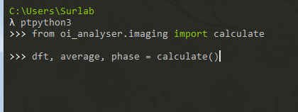
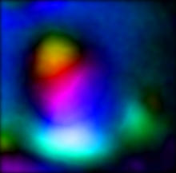
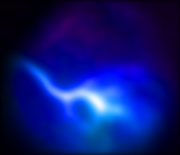

# Optical Imaging analysis scripts

These scripts are designed analyze optical imaging results acquired with [CortexView2](https://github.com/Palpatineli/CortexView2).

### example

A typical analysis starts with

```python3
from oi_analyser.imaging import calculate
dft, average, frame_phase = calculate()
```

This function will open a dialog, so you can select the recording file (.h5) to analyze.



When it's done, it will show you the amplitude, phase, and a colorized image of the dft result.
If you have further analysis to do, 'dft' is the complex array with the Fourier transformed result to work on.
You can also ignore the 2 latter results (average and frame_phase) if you wish.
Average is the average of absolute power in each of the pixels, basically the background without the modulation.
If you suspect the different lighting between different areas significantly affect the cortex modulation result,
you may want to normalize the dft by the average frame.

For retinotopic in V1, this is an example of good recording (for the colorized panel)



And this is a bad example



For monocular recordings where you cover the contra eye, the binocular zone is smaller so don't expect as good a result.
Left and right are flipped due to the way the camera scans.
So if you image the left V1, in the resulting image left will be mid line and right is lateral.
